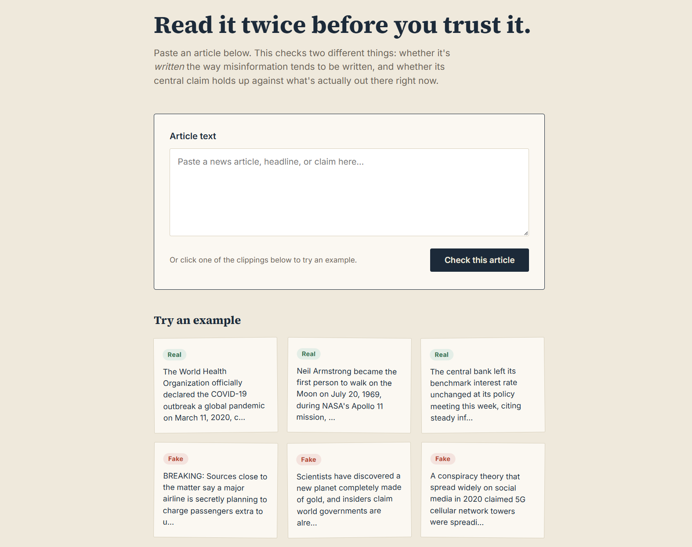
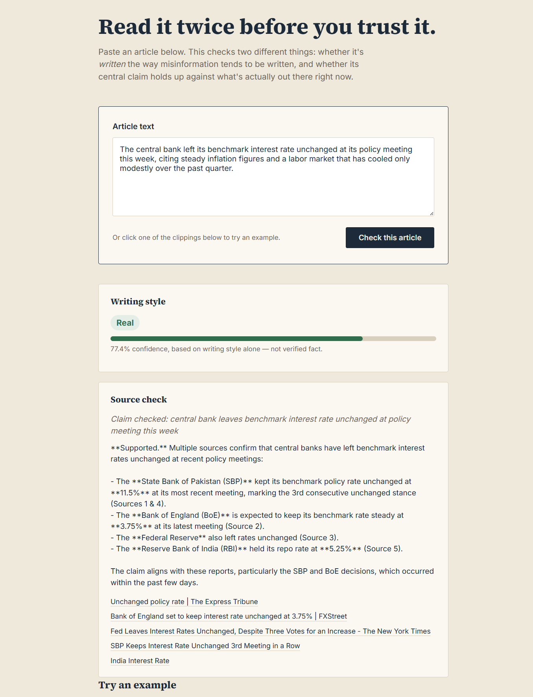
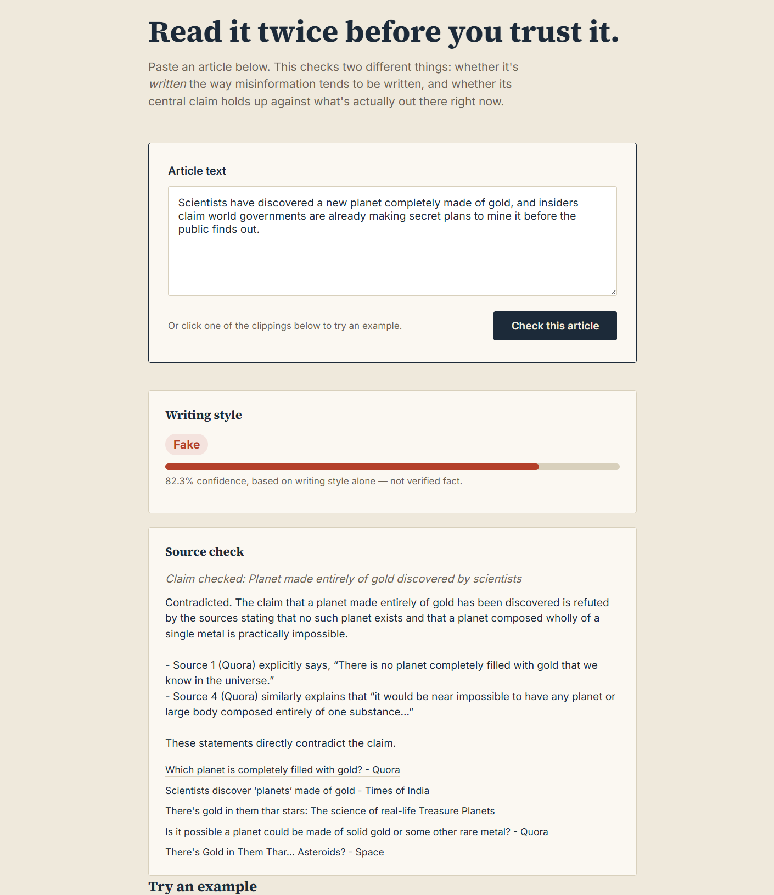

# Fake News Detector (RoBERTa + Fact-Checking)

A RoBERTa-based classifier fine-tuned to detect fake news, paired with a
live, web-search-grounded fact-checking step, served through a Flask web app.

## Screenshots

**Interface**


**Real news example**


**Fake news example**


## What's in here

- `train_fake_news_model.py` — fine-tunes `roberta-base` on ISOT (`Fake.csv`/`True.csv`)
  + LIAR for binary real/fake classification, and evaluates on a held-out test set.
- `predict.py` — classifies a piece of text as Real/Fake using the trained
  RoBERTa model, and separately fact-checks its main claim by searching the
  web and asking an LLM to judge it using only the retrieved sources.
- `webapp/` — Flask app with a browser UI: paste an article, get both a
  writing-style verdict (from the RoBERTa classifier) and a source-grounded
  fact-check (web search + LLM).

## How it works

1. **Writing-style classifier** — a RoBERTa model fine-tuned on labeled
   real/fake articles predicts whether the *way* an article is written
   matches patterns typical of misinformation. This is a style signal, not
   a truth signal.
2. **Fact-check** — separately, the main claim is extracted from the
   article, the web is searched for real sources about it, and an LLM
   judges Supported / Contradicted / Uncertain using *only* those retrieved
   sources (never its own memory).

The two results are kept separate on purpose, so a confident style
prediction is never mistaken for a verified fact.

## Datasets

- **ISOT Fake News Dataset** (`Fake.csv` / `True.csv`):
  https://www.kaggle.com/datasets/clmentbisaillon/fake-and-real-news-dataset
  Download and place both CSVs in the project root.

- **LIAR dataset**:
  https://www.cs.ucsb.edu/~william/data/liar_dataset.zip
```bash
  wget https://www.cs.ucsb.edu/~william/data/liar_dataset.zip
  unzip liar_dataset.zip -d liar_dataset
```
  so `liar_dataset/train.tsv`, `test.tsv`, `valid.tsv` sit in the project root.

## Setup

```bash
pip install -r requirements.txt
```

## Training

```bash
python train_fake_news_model.py
```
Saves the fine-tuned model + tokenizer to `./fake_news_model/` (this folder
is not included in the repo — you'll need to train locally or download
weights separately).

## Predicting + fact-checking a single article

```bash
export OPENROUTER_API_KEY=your-key-here   # needed for the fact-check step
python predict.py
```
(edit the `text` variable at the bottom, or import the functions elsewhere)

## Running the web app

```bash
cd webapp
export OPENROUTER_API_KEY=your-key-here   # optional -- enables fact-checking
python app.py
```
Then open `http://localhost:5000`. Make sure `fake_news_model/` (from
training) is accessible at the path set in `webapp/app.py`.

## Notes on the classifier

The RoBERTa classifier detects *writing style* patterns associated with
misinformation — it does not verify facts. The fact-check feature is a
separate, complementary signal grounded in live search results, not the
LLM's own training data.
